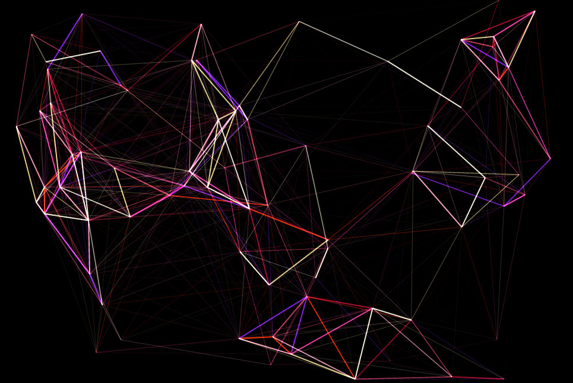

# Node Web
## An exercise in canvas

Watch as `NODE_COUNT` nodes bounce around on screen, connected by lines that vary with distance!

[Live](https://rangerdane.github.io/nodeweb)

## Features
* Neat lines
* Beautiful colors
* Also works on mobile

## Why?
I was inspired by the really neat ending credits of Ex Machina
